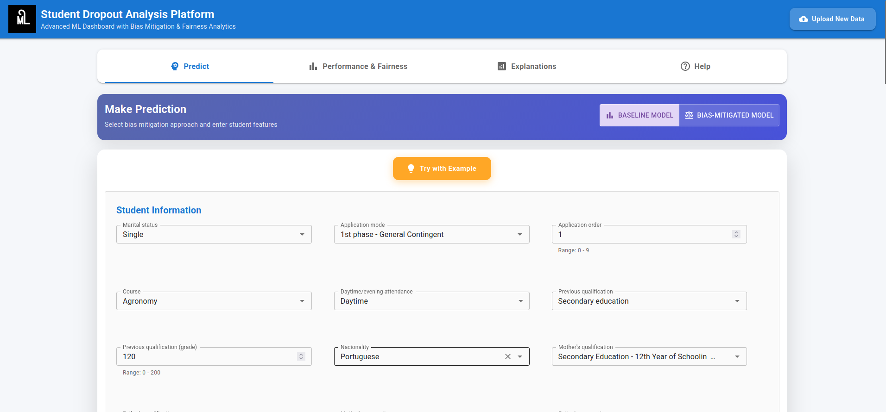
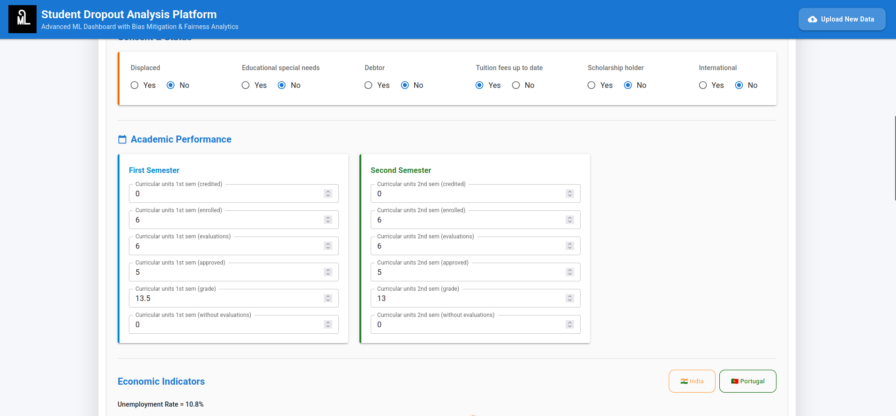
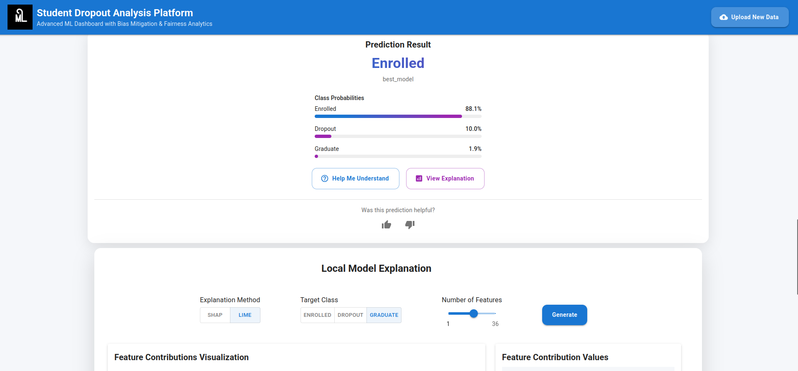
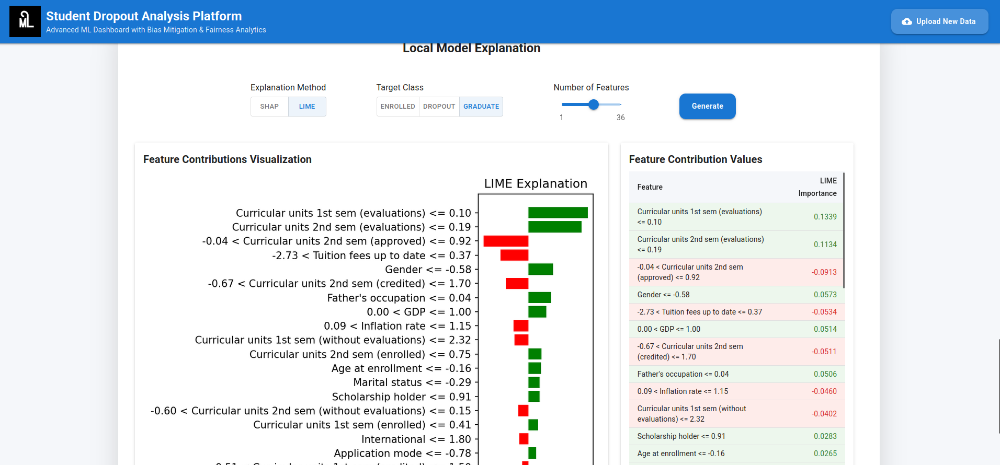
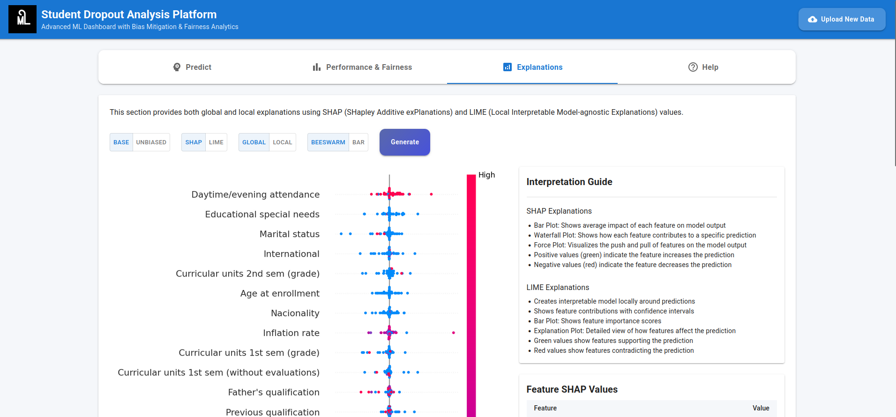
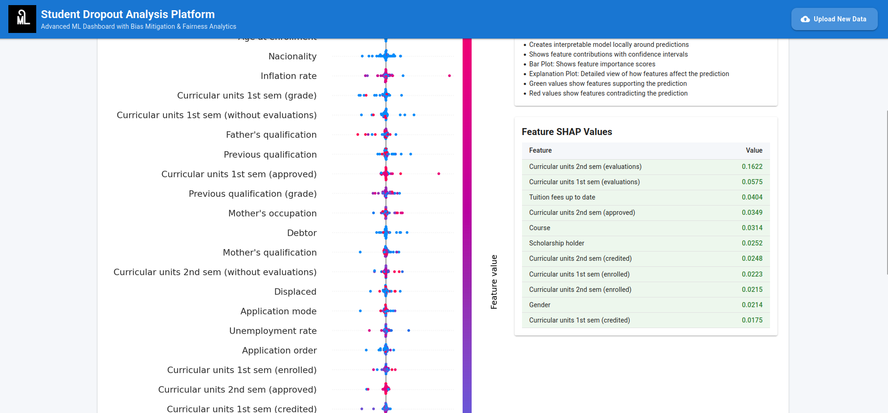
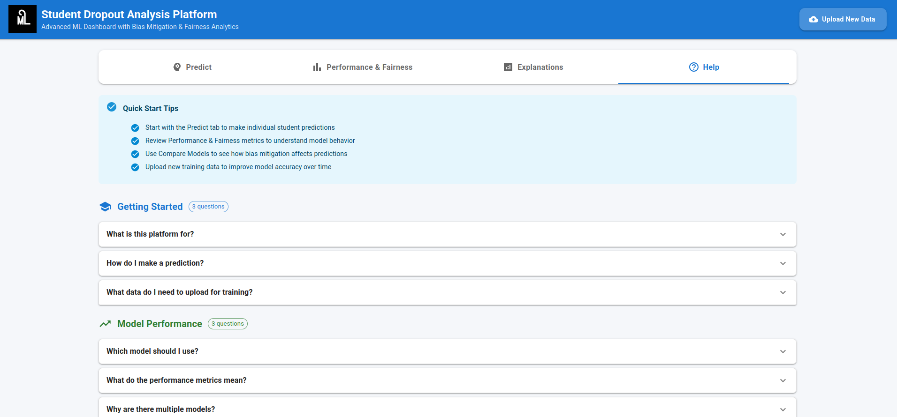

# CS698-HAI-Project

### Installation

#### Frontend

1. Navigate to the `frontend` directory:
   ```bash
   cd frontend
   ```
2. Install the required dependencies:
   ```bash
   npm install
   ```
3. Start the development server:
   ```bash
   npm run dev
   ```

#### Backend

1. Navigate to the `backend` directory:
   ```bash
   cd backend
   ```
2. Install the required dependencies:
   ```bash
   pip install -r requirements.txt
   ```
3. Start the backend server:
   ```bash
   python app.py
   ```

### Usage

1. Open your web browser and go to `http://localhost:5073` to access
   the frontend application.
2. The frontend will communicate with the backend server running at
   `http://localhost:5000`.

### Project Structure

- `frontend/`: Contains the React frontend application.
- `backend/`: Contains the FAST-api backend application.


### Demo Images








